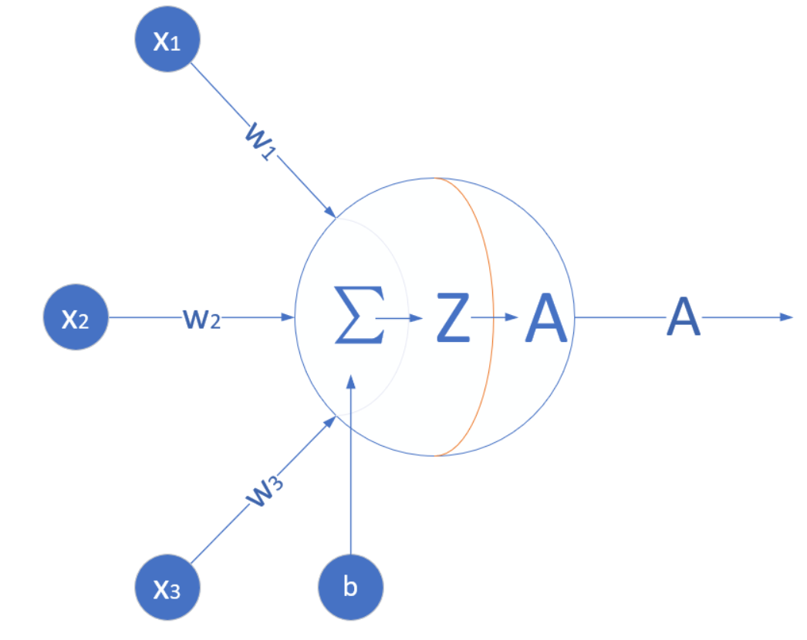
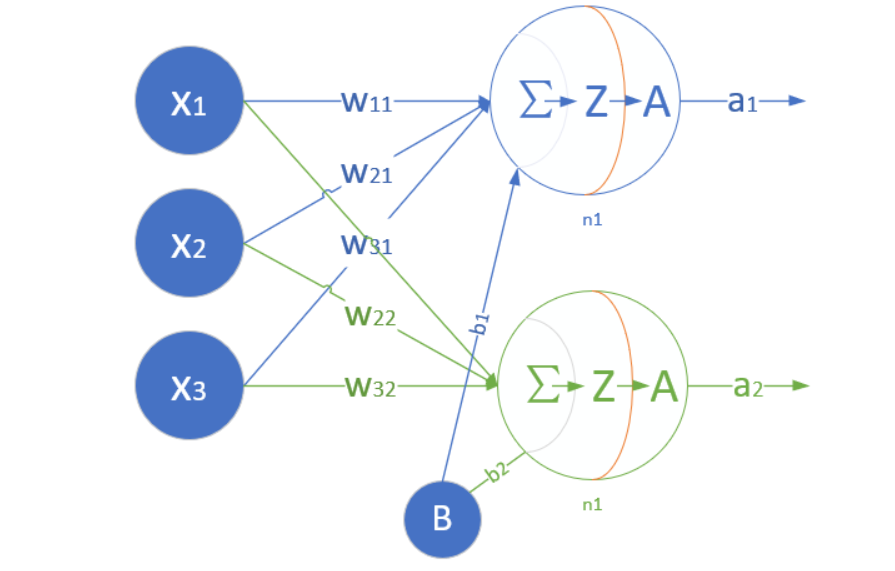
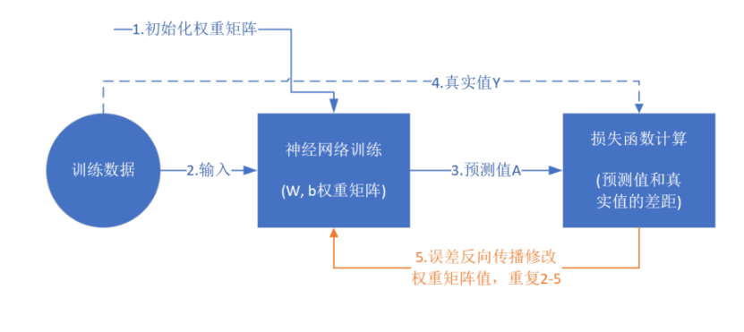

## 2月24日的总结
### 神经元细胞的数学模型
如图所示：

+ 输入 input：(x1,x2,x3)是外界输入信号，一般是一个训练数据样本的多个属性。
+ 权重 weights：(w1,w2,w3) 是每个输入信号的权重值。
+ 偏移 bias：b是偏移值.
+ 求和计算 sum
+ 激活函数 activation: 激活函数都是有一个渐变的过程，也就是说是个曲线。
+ 小结：
    + 一个神经元：
    + 可以有多个输入
    + 只能有一个输出，这个输出可以同时输入给多个神经元
    + w的数量和输入的数量一致
    + 只有一个b
    + w和b有人为的初始值，在训练过程中被不断修改
    + 激活函数不是必须有的，亦即A可以等于Z
    + 一层神经网络中的所有神经元的激活函数必须一致
### 神经网络的训练过程
如图所示：

+ $(x_1,x_2,x_3)$是一个样本数据的三个特征值
+ $(w_{11},w_{21},w_{31})$是$(x_1,x_2,x_3)$到$n1$的权重
+ $(w_{12},w_{22},w_{32})$是$(x_1,x_2,x_3)$到$n2$的权重
+ $b_1$是$n1$的偏移
+ $b_2$是$n2$的偏移
#### 训练流程
如图所示：
#### 前提条件
+ 1.首先是我们已经有了训练数据
+ 2.我们已经根据数据的规模、领域，建立了神经网络的基本结构，比如有几层，每一层有几个神经元
+ 3.定义好损失函数来合理地计算误差
#### 步骤
1. 随机初始化权重矩阵，可以根据正态分布等来初始化。
2. 拿一个或一批数据作为输入，带入权重矩阵中计算，再通过激活函数传入下一层，最终得到预测值。
3. 拿到Id-1样本的真实值Y=3；
4. 计算损失，假设用均方差函数 $Loss = (A-Y)^2=(5-3)^2=4$；
5. 根据一些神奇的数学公式（反向微分），把Loss=4这个值用大喇叭喊话，告诉在前面计算的步骤中，影响A=5这个值的每一个权重矩阵，然后对这些权重矩阵中的值做一个微小的修改；
6. 用Id-2样本作为输入再次训练；
7. 这样不断地迭代下去，直到以下一个或几个条件满足就停止训练：损失函数值非常小；准确度满足了要求；迭代到了指定的次数。
### 神经网络的主要功能
1. 回归/拟合
2. 分类
#### 激活函数
激活函数的作用:一个没有激活函数的神经网络将只不过是一个线性回归模型.同样是因为没有激活函数，我们的神经网络将无法学习和模拟其他复杂类型的数据。
+ Sigmoid激活函数：$$a = \frac{1}{1+e^{-z}}=\frac{1}{1+e^{-(wx+b)}}$$ 
#### 深度神经网络与深度学习：三层以上的网络称为深度神经网络。
1. 卷积神经网络(CNN)对于图像类的机器学习问题，最有效的就是卷积神经网络
2. 循环神经网络(RNN)对于语言类的机器学习问题，最有效的就是循环神经网络。
#### 深度学习的训练过程
1. 使用自下上升非监督学习（就是从底层开始，一层一层的往顶层训练）
2. 自顶向下的监督学习（就是通过带标签的数据去训练，误差自顶向下传输，对网络进行微调）
### 总结
这次我们主要学习的是神经网络的基本工作原理，首先我们先了解下人工智能的发展，然后开始了解神经网络模型，神经网络模型是逻辑单元按照不同层级组织起来的网络，每一层的输出变量都是下一层的输入变量。同时，我们还学习了反向传播，反向传播算法（首先计算最后一层的误差，然后再一层一层反向求出各层的误差，直到倒数第二层。），相较于正向传播算法，反向传播算法更快。