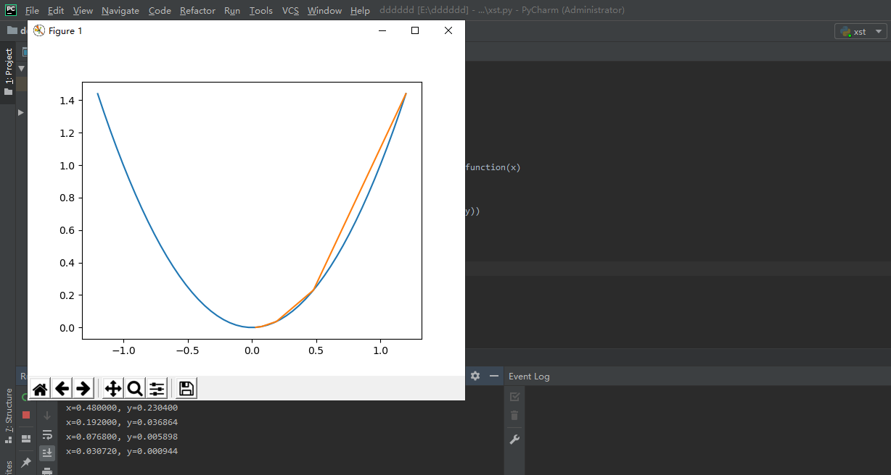
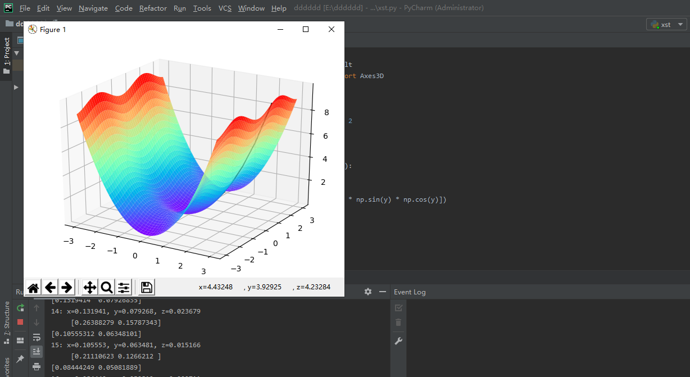
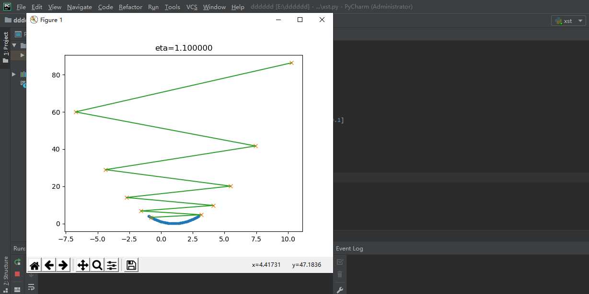
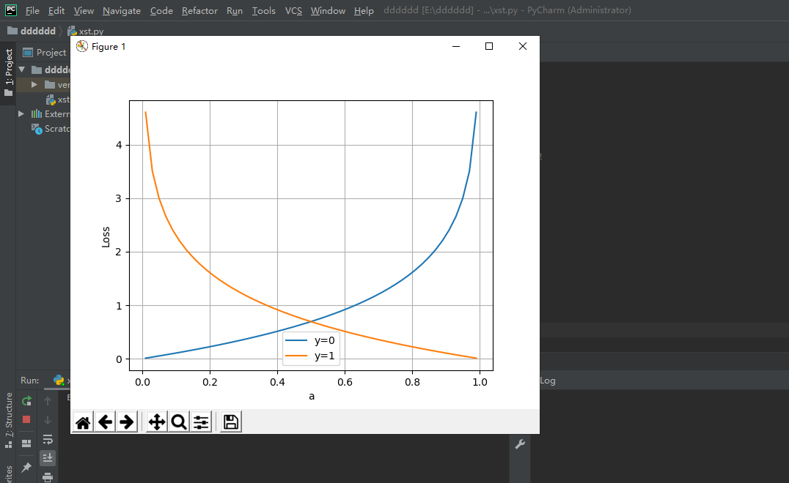

## 2月25日的总结
### 梯度下降
+ 梯度下降是迭代法的一种,可以用于求解最小二乘问题(线性和非线性都可以)。
+ 在求解机器学习算法的模型参数，即无约束优化问题时，梯度下降是最常采用的方法之一，另一种常用的方法是最小二乘法。
+ 在求解损失函数的最小值时，可以通过梯度下降法来一步步的迭代求解，得到最小化的损失函数和模型参数值。
+ 在机器学习中，基于基本的梯度下降法发展了两种梯度下降方法，分别为随机梯度下降法和批量梯度下降法。
#### 梯度下降的三要素
1. 当前点；
2. 方向；
3. 步长。
#### “梯度下降”的两层含义
1. 梯度：函数当前位置的最快上升点；
2. 下降：与导数相反的方向，用数学语言描述就是那个减号。
#### 运行结果
+ 
+ 
+ 
### 损失函数
损失就是所有样本的误差总和。
+ $$损失 = \sum^m_{i=1}，误差：i$$ $$J = \sum_{i=1}^m loss$$
#### 损失函数的作用
计算神经网络每次迭代的前向计算结果与真实值的差距，从而指导下一步的训练向正确的方向进行。
#### 如何使用损失函数
1. 用随机值初始化前向计算公式的参数；
2. 代入样本，计算输出的预测值；
3. 用损失函数计算预测值和标签值（真实值）的误差；
4. 根据损失函数的导数，沿梯度最小方向将误差回传，修正前向计算公式中的各个权重值；
5. goto 2, 直到损失函数值达到一个满意的值就停止迭代
#### 机器学习中的损失函数
符号规则：a是预测值，y是样本标签值，J是损失函数值。
+ Gold Standard Loss，又称0-1误差 $$ loss=\begin{cases} 0 & a=y \ 1 & a \ne y \end{cases} $$
绝对值损失函数
$$ loss = |y-a| $$
+ Hinge Loss，铰链/折页损失函数或最大边界损失函数，主要用于SVM（支持向量机）中
$$ loss=max(0,1-y \cdot a), y=\pm 1 $$
+ Log Loss，对数损失函数，又叫交叉熵损失函数(cross entropy error)
$$ loss = -\frac{1}{m} \sum_i^m y_i log(a_i) + (1-y_i)log(1-a_i) \qquad y_i \in {0,1} $$
+ Squared Loss，均方差损失函数 $$ loss=\frac{1}{2m} \sum_i^m (a_i-y_i)^2 $$
+ Exponential Loss，指数损失函数 $$ loss = \frac{1}{m}\sum_i^m e^{-(y_i \cdot a_i)} $$
#### 神经网络中的损失函数
##### 均方差函数，主要用于回归
该函数就是最直观的一个损失函数了，计算预测值和真实值之间的欧式距离。预测值和真实值越接近，两者的均方差就越小。
+ 公式
    + $$ loss = {1 \over 2}(z-y)^2 \tag{单样本} $$
    + $$ J=\frac{1}{2m} \sum_{i=1}^m (z_i-y_i)^2 \tag{多样本} $$
+ 工作原理：
    + 要想得到预测值a与真实值y的差距，最朴素的想法就是用$Error=a_i-y_i$。
    + 对于单个样本来说，这样做没问题，但是多个样本累计时，$a_i-y_i$有可能有正有负，误差求和时就会导致相互抵消，从而失去价值。所以有了绝对值差的想法，即$Error=|a_i-y_i|$。
##### 交叉熵函数，主要用于分类
是Shannon信息论中一个重要概念，主要用于度量两个概率分布间的差异性信息。
+ 公式:$$H(p,q)=\sum_i p_i \cdot log {1 \over q_i} = - \sum_i p_i \log q_i$$
+ 交叉熵的由来：
    + 信息量：$$I(x_j) = -\log (p(x_j))$$（$x_j$：表示一个事件；$p(x_j)$：表示$x_i$发生的概率；$I(x_j)$：信息量，$x_j$越不可能发生时，它一旦发生后的信息量就越大）
    + 熵：$$H(p) = - \sum_j^n p(x_j) \log (p(x_j))$$
    + 相对熵（KL散度）：,如果我们对于同一个随机变量 x 有两个单独的概率分布 P(x) 和 Q(x)，我们可以使用KL散度来衡量这两个分布的差异，这个相当于信息论范畴的均方差。
    + 公式：$$D_{KL}(p||q)=\sum_{j=1}^n p(x_j) \log{p(x_j) \over q(x_j)}$$（n为时间的所有可能性。D的值越小，表示q分布和p分布越接近）
+ 不能使用均方差作为分类问题的损失函数原因
    + 回归问题通常用均方差损失函数，可以保证损失函数是个凸函数，即可以得到最优解。而分类问题如果用均方差的话，损失函数的表现不是凸函数，就很难得到最优解。而交叉熵函数可以保证区间内单调。
    + 分类问题的最后一层网络，需要分类函数，Sigmoid或者Softmax，如果再接均方差函数的话，其求导结果很复杂，运算量比较大。用交叉熵函数的话，可以得到比较简单的计算结果，一个简单的减法就可以得到反向误差。
3. 二者都是非负函数，极值在底部，用梯度下降法可以求解
### 运行结果

### 总结心得
这次我们学习的是梯度下降和损失函数，知道了梯度下降有随机梯度下降法和批量梯度下降法，并分别测试了实验代码，随后开始学习损失函数，了解到均方差函数，主要用于回归；交叉熵函数，主要用于分类，并对交叉熵函数进行了代码测试。通过两次的代码测试，使我对梯度下降和损失函数有了更深刻的理解。
